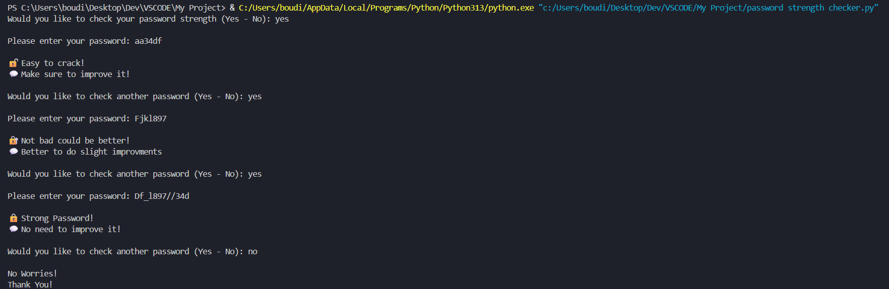

# 🔐 Password Strength Checker (Python)

A simple Python tool that checks how strong a password is based on different rules like length, uppercase letters, lowercase letters, numbers, and symbols.

---

## 📸 Screenshot

---

## 🚀 Features

- 🔍 Checks password strength in real time  
- 🔠 Detects uppercase and lowercase letters  
- 🔢 Checks for numbers  
- 🔣 Checks for symbols  
- 📏 Considers password length  
- 📊 Gives a strength score (Weak / Medium / Strong)  
- 🔁 Option to test multiple passwords  

---

## 🧠 Strength Levels

- **0 - 2:** 🔓 Weak password  
- **3 - 4:** 🔐 Medium password  
- **5:** 🔒 Strong password  

---

## 🛠️ Technologies Used

- Python 3  
- `string` module  
- Loops and conditionals  
- Basic input handling  

---

## 👨‍💻 Author

**Abdo**  
Cybersecurity Student | Networking Basics | Python Enthusiast
